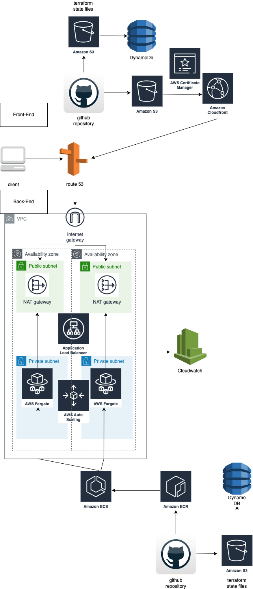

# JOB-POST-API

## Architecture Overview

This project's infrastructure is built on AWS, utilizing several services for optimized performance, security, and reliability.

### Back-End

The back-end architecture is designed for high availability and fault tolerance:

- **Route 53**: AWS's DNS service, directing the user's request to the appropriate server.
- **VPC**: Isolated section of the AWS cloud populated with AWS resources in a virtual network.
- **Internet Gateway**: Connects the VPC to the internet, allowing communication between resources in the VPC and the internet.
- **NAT Gateway**: Enables instances in a private subnet to connect to the internet or other AWS services, but prevent the internet from initiating a connection with those instances.
- **Application Load Balancer (ALB)**: Automatically distributes incoming application traffic across multiple targets, such as EC2 instances, containers, and IP addresses.
- **Amazon ECS on Fargate**: A serverless compute engine that allows you to run containers without managing servers or clusters.
- **AWS Auto Scaling**: Monitors applications and adjusts capacity to maintain steady, predictable performance.
- **Amazon ECR**: Docker container registry service that allows developers to store, manage, and deploy Docker container images.

### Monitoring

- **CloudWatch**: Provides monitoring for AWS cloud resources and the applications running on AWS.

# Example: How to get a development environment running
npm run dev
- **or if you are using yarn**:

yarn dev

